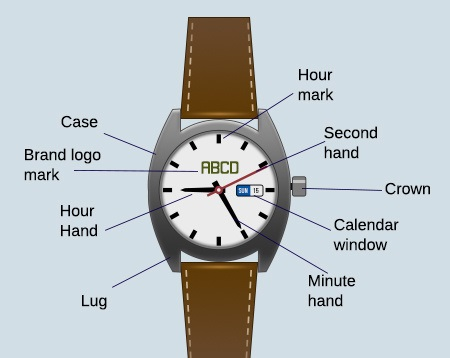

## Case Study-01
## Name: Case_Study01_Analog_Watch

### Problem Statement
Lets Consider `Analog Watch` of different  Companies to write the code Snippet 
and use Abstract class and Interface Logic to Implement it.

Follow the List of Points to Implement it.
1. Consider analog Watches of different Companies like `FastTrack`, `Titan`,`Timex`

2. Moving Hand:Hour Hand, Minute Hand and Second Hand

3. Strap Color: Black or Brown or Gold

4. Strap Type: Metal or Leather

5. Watch Price: Min Cost `1500` INR and Max `10000` INR 

6. Made In: India or Germany or Switzerland  

6. Calender Window facility may or maynot exist varies from Company to other 
   Company. Consider this facility as New feature in analog watch

7. Its Mandatory to follow proper Naming conventions, code Formatting,Code
   Commenting (use `#region`, `#endregion` and `Summary`of classes and its functionality)

### Expected Outcome 

#### To push the code in gitlab you can follow these steps

1. Create Project and Name the project as  **Case_Study01_Analog_Watch** in your local machine

2. Navigate to Hackathon2k20_analogWatch folder

    `cd Case_Study01_Analog_Watch`

3. Remove its remote or original reference

     `git remote rm origin`

4. Create a new repo in gitlab named `Case_Study01_Analog_Watch` as private repo

5. Add your new repository reference as remote

     `git remote add origin https://gitlab-cgi.stackroute.in/{{yourusername}}/Case_Study01_Analog_Watch.git`

     **Note: {{yourusername}} should be replaced by your username from gitlab**

5. Check the status of your repo 
     
     `git status`

6. Use the following command to update the index using the current content found in the working tree, to prepare the content staged for the next commit.

     `git add .`
 
7. Commit and Push the project to git

     `git commit -a -m "Initial commit | or place your comments according to your need"`

     `git push -u origin master`

8. Check on the git repo online, if the files have been pushed